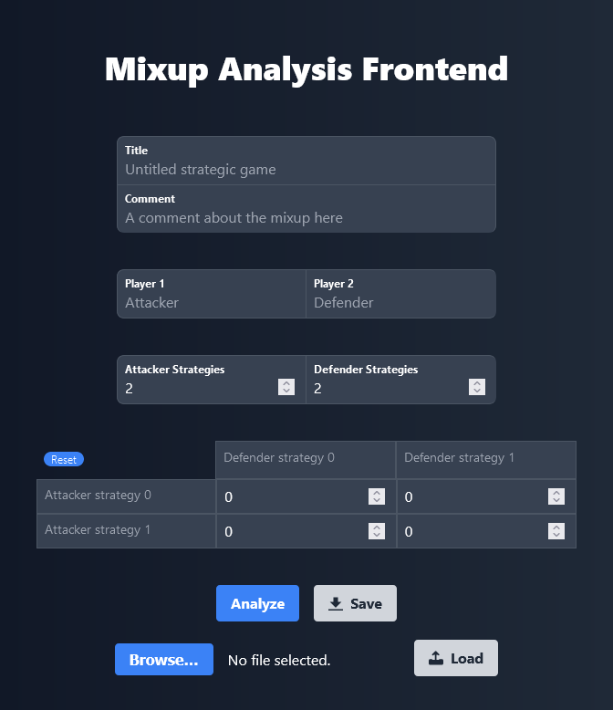

# Mix-up Analysis Web App

[](https://github.com/prettier/prettier)




A web app to more easily create [mix-up analyses](https://wavu.wiki/t/Template:Mixup) for [Wavu Wiki](https://wavu.wiki/t/Main_Page).
Based on the work done by [RodgerDodger](https://wavu.wiki/t/User:RogerDodger).

## Installation

### Using Docker

```bash
git clone git@github.com:AbhijeetKrishnan/mixup-analysis-app.git
cd mixup-analysis-app
docker compose up -d --build
```

_Note_: Will take a _long_ time at the step to build the `pygambit` wheel!

The web app will be live at http://localhost:3000/.

### Without Docker

```bash
git clone git@github.com:AbhijeetKrishnan/mixup-analysis-app.git
cd mixup-analysis-app

# Start backend server at http://localhost:8000/
cd backend
python3 -m pip install -r requirements.txt
python3 main.py

# Build frontend
cd frontend
npm ci --omit-build
npm run build

# Start frontend server at http://localhost:3000/
node build
```

The web app will be live at http://localhost:3000/.
